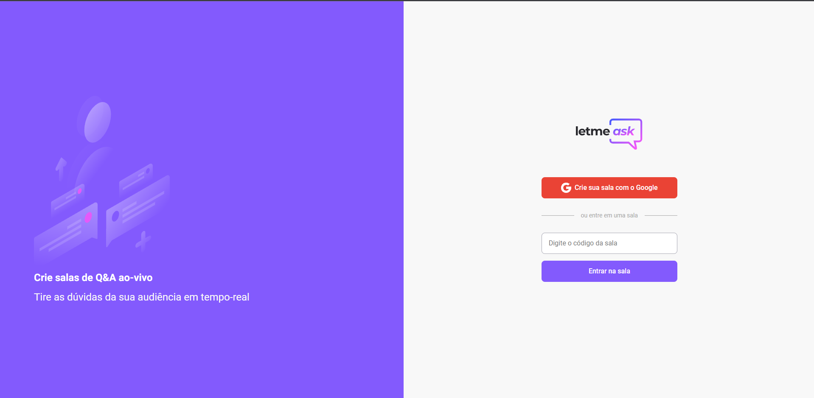
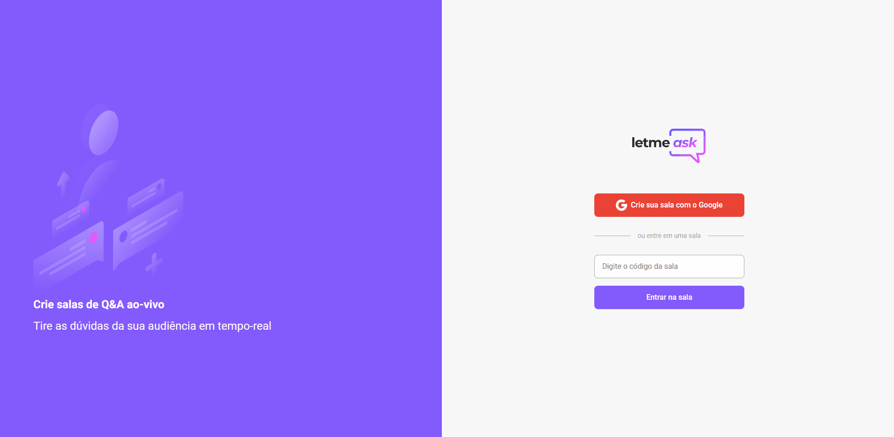
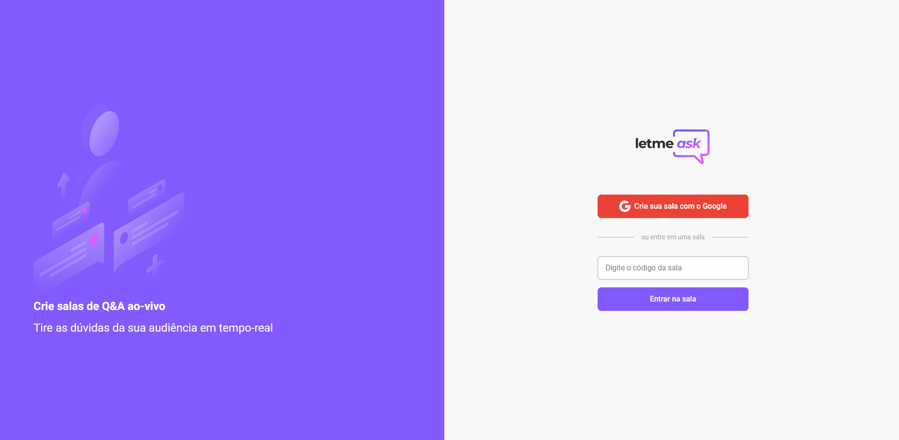

<h1 align="center">
    
</h1>

<p align="center"> 
  O projeto tem o objetivo de auxiliar no controle de perguntas durante lives, 
  te possibilitando criar uma sala, e deixar seu público criar as perguntas, 
  como admin você pode excluir a pergunta, marcar como respondida e destacar.
  Como público você pode criar e curtir perguntas.

  <br>
  <a href="https://leatmeask-4458b.firebaseapp.com/" target="_blank">Acessar o LeatMeask</a>
</p>

## :computer: Aplicação Web
  <table>
    <tr>
      <th width="100%">
        Landing
      </th>
    </tr>
    <tr>
      <td>
          
      </td>
    </tr>
  </table>

<table>
  <tr>
    <th width="100%">
      Admin
    </th>
  </tr>
  <tr>
    <td>
        
    </td>
  </tr>
</table>

<table>
  <tr>
    <th width="100%">
      Público
    </th>
  </tr>
  <tr>
    <td>
        
    </td>
  </tr>
</table>

## :bulb: Principais funcionalidades

* Cadastrar Salas.

* Cadastrar perguntas.

* Manipular as perguntas(Dar like, Marcar como respondido, deletar e destacar).

* Fechar sala.

## :wrench: Pré-requisitos

 Antes de começar, você vai precisar ter instalado em sua máquina as seguintes ferramentas:
[Node.js](https://nodejs.org/en/) e um editor para trabalhar com o código como o [VSCode](https://code.visualstudio.com/).

## :rocket: Para rodar a aplicação

```bash

# Clone este repositório
$ git clone https://github.com/Joaobru/Leatmeask.git

# Acesse a pasta do projeto no seu terminal/cmd
$ cd Leatmeask-master

# Execute o seguinte comando para instalar todas as dependências
$ npm install ou yarn

# Entre na pasta src/services/firebase.ts e preencha os valores 
# em vez de usar process.env.

# Rode o projeto com o seguinte comando.
npm run start ou yarn start

# Agora você pode acessar em localhost:3000.

```

## 🛠 Tecnologias
  * [React](https://pt-br.reactjs.org/);

  * [TypeScript](https://www.typescriptlang.org/);

  * [Firebase](https://firebase.google.com/?hl=pt);

<h2> :book: Licença </h2>
<p>Lançado em 2021 :book:</p></br>
<p>Feito por João Paulo Brune Dos Santos. Este projeto está sobre a licença do MIT</p></br>
<p>Dar uma :star: se este projeto te ajudou</p>
